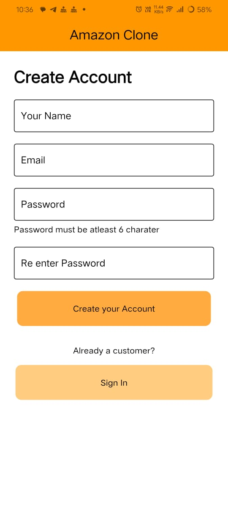
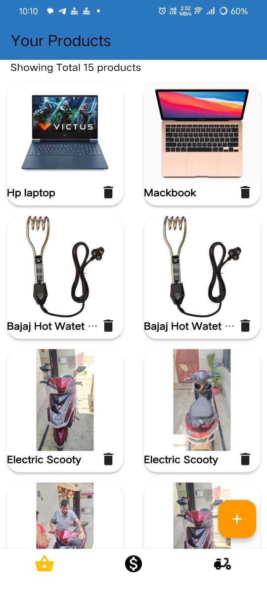

# 🛒 Amazon Clone App
An Amazon Clone Android application 📱 built using Flutter 💙

---

## ❤️ Try App
### 📲 Scan QR Code
  


---

### 📦 Get APK
[Download here](https://drive.google.com/file/d/1JT0FN5KJWJXXGRHOGpy1DOU1e3rp0HJM/view?usp=drive_link)

---

## 🛍️ Amazon Clone App

The **Amazon Clone App** is a full-featured e-commerce mobile application built using **Flutter**. It mimics the core functionalities of Amazon, including a rich user experience for both customers and admins.

Users can browse products by categories, view detailed product descriptions, add items to their cart, and complete orders. Admins can sign in through a dedicated panel to add, update, and manage product listings with image upload functionality.

This app demonstrates a powerful integration of **Firebase Authentication**, **Cloudinary image uploads**, **state management with Provider**, and RESTful APIs — all wrapped in a modern and responsive Flutter UI.

---

### 💡 Use Cases

- Practice real-world mobile app development using Flutter
- Learn how to build scalable app architecture with provider
- Firebase authentication implementation
- Client-server communication via APIs
- Admin dashboard + user interface within one codebase
  

## ⚙️ Features

- Firebase Authentication (Sign in / Sign up)
- Admin Panel to add and manage products
- Upload product images using Cloudinary
- Display products by category
- Add to Cart and Purchase flow
- Separate UI for User and Admin
- Responsive and modern UI/UX

---

## 🚀 Technology Used

- **Flutter** (Dart)
- **Firebase Authentication**
- **Cloudinary API**
- **MongoDB / Node.js** (optional for backend)
- **Provider** (state management)
- **REST API**

---

## 📸 Screenshots

|                                 |                                  |                                    |
|:-------------------------------:|:--------------------------------:|:----------------------------------:|
|  |  |  |
|  |  |   |
|  |   |

---

## ⚡ Dependencies Used
```yaml
dependencies:
  flutter:
    sdk: flutter
  provider: ^6.0.0
  flutter_svg: ^1.1.0
  http: ^0.13.4
  image_picker: ^0.8.4+3
  cloudinary_public: ^0.10.0
  shared_preferences: ^2.0.6
  firebase_auth: ^4.6.2
